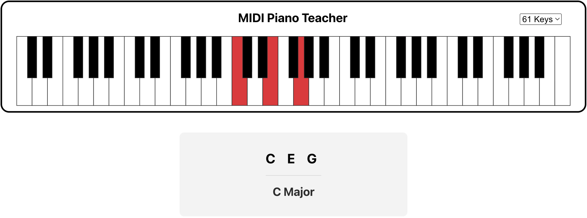

# MIDI Piano Teacher

**A Web-based MIDI Piano Learning App**

Simply connect your MIDI Piano and start playing!

## Explore Different Chords

View the Chord Explorer to visualize the shapes and positions of each chord on a virtual keyboard

## Practice Chords

Select the Chord groups (Major, Minor, Suspended, etc.) you want to practice, then play the chords on screen to progress

### Timed Mode

Select the Chord groups (Major, Minor, Suspended, etc.) you want to test out, then see how many chords you can play correctly in a minute.

View your High Scores and graphs of your progress over time

## Browser Support

Your browser needs to support the Web MIDI API for MIDI Piano Teacher to work:
- Chrome, Edge, and Firefox should all work.
- Safari is **not supported**
